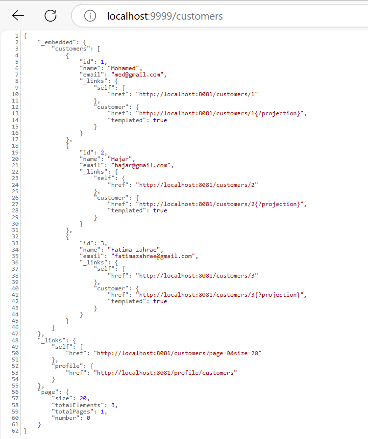
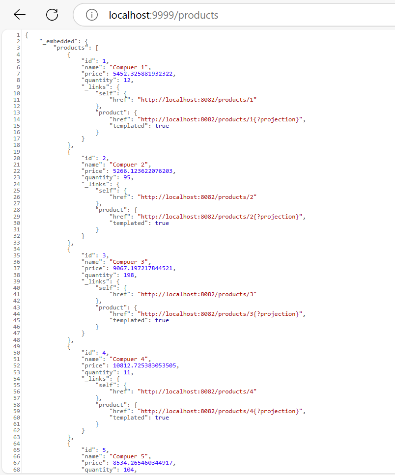
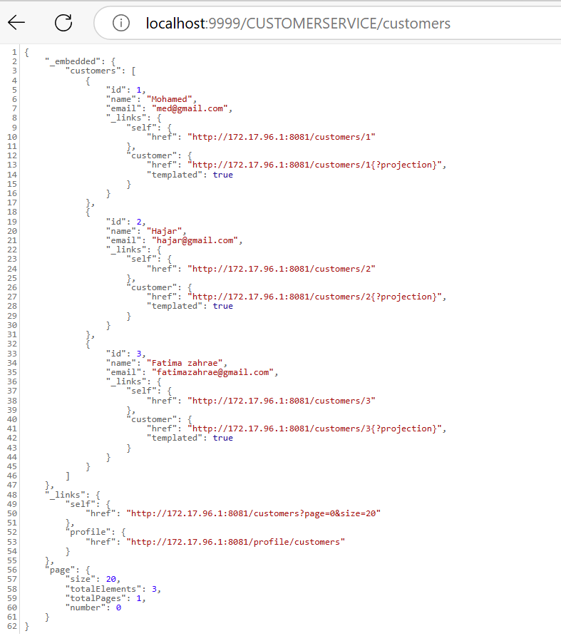
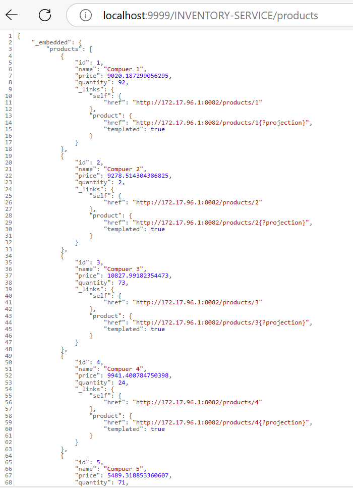
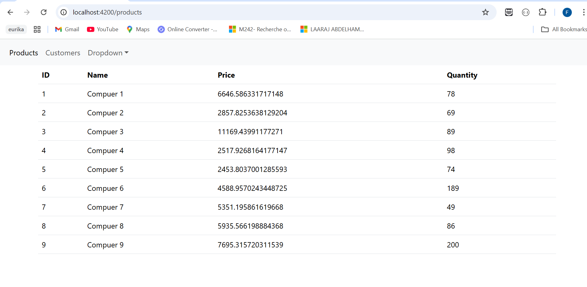
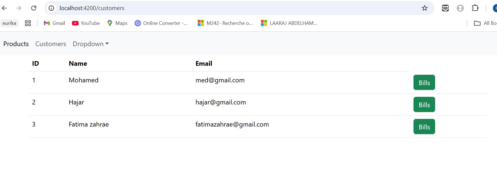
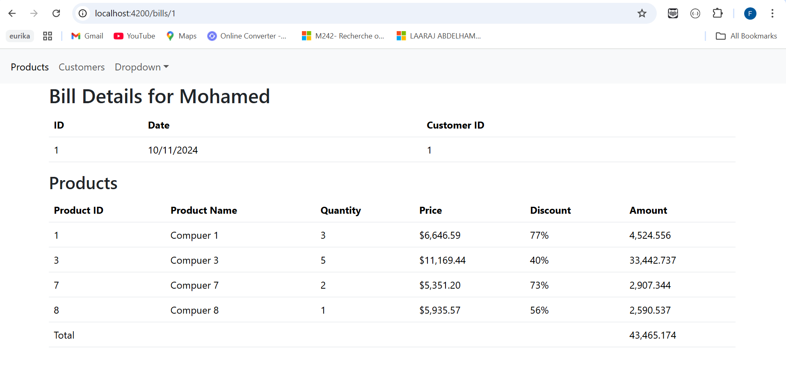

# Gestion de Factures - Application Micro-Services

## Description

Cette application est une solution basée sur une architecture micro-services qui permet de gérer les factures associées à des clients et contenant des produits. Le système est composé de plusieurs services indépendants qui interagissent pour gérer les données des clients, des produits, et des factures, le tout accessible via un client Angular.

### Objectifs :
- Développer une architecture flexible et évolutive en utilisant des micro-services pour une meilleure gestion et maintenance des différents composants.
- Utiliser **Spring Cloud Eureka** pour le service d'annuaire qui enregistre et découvre les services disponibles.
- Intégrer **Spring Cloud Gateway** comme passerelle, permettant un routage centralisé des requêtes aux différents services backend.
- Déployer une application frontale avec **Angular** pour offrir une interface utilisateur pour la visualisation des factures.

---

## Prérequis

- **Java 11** ou supérieur
- **Maven**
- **Node.js** et **Angular CLI**
- **Docker** (optionnel, pour conteneuriser les micro-services)

---

## Architecture

L'architecture micro-services de l'application est composée de :

1. **Customer-service** : Service pour la gestion des clients
2. **Inventory-service** : Service pour la gestion des produits
3. **Billing-service** : Service pour la gestion des factures, avec des appels interservices pour obtenir les détails des clients et des produits
4. **Gateway-service** : Passerelle centralisée pour le routage des requêtes vers les services backend
5. **Registry-service (Eureka)** : Service d'annuaire pour enregistrer et découvrir dynamiquement les micro-services

---

## Services

### 1. Customer-service
- **Description** : Ce micro-service gère les informations des clients.
- **Technologies** : Spring Boot, Spring Data, Spring Data REST
- **Endpoints** : API RESTful générée pour gérer les entités Client

### 2. Inventory-service
- **Description** : Ce micro-service gère les produits.
- **Technologies** : Spring Boot, Spring Data, Spring Data REST
- **Endpoints** : API RESTful générée pour gérer les entités Produit

### 3. Gateway-service
- **Description** : Passerelle utilisant Spring Cloud Gateway pour rediriger les requêtes vers les différents services.
- **Configuration statique** : Configurée via le fichier `application.yml`
- **Configuration dynamique** : Utilise des configurations Java pour définir les routes de façon dynamique.

### 4. Registry-service (Eureka Server)
- **Description** : Service d'annuaire basé sur Netflix Eureka pour enregistrer et découvrir les micro-services.
- **Fonctionnalité** : Permet la découverte des services et leur disponibilité pour des configurations dynamiques de routage dans le Gateway.

### 5. Billing-service
- **Description** : Service de gestion des factures, qui communique avec Customer-service et Inventory-service via Open Feign.
- **Technologies** : Spring Boot, Open Feign pour l'intégration des services.
- **Endpoints** : Fournit des API pour gérer les factures et récupérer les informations clients/produits associés.

---

## Installation et Exécution

1. Clonez le dépôt :
   ```bash
   git clone <https://github.com/ZerheriFatimaZahrae/Ecom-APP-Micro-Services-PW2>

## Execution : 











